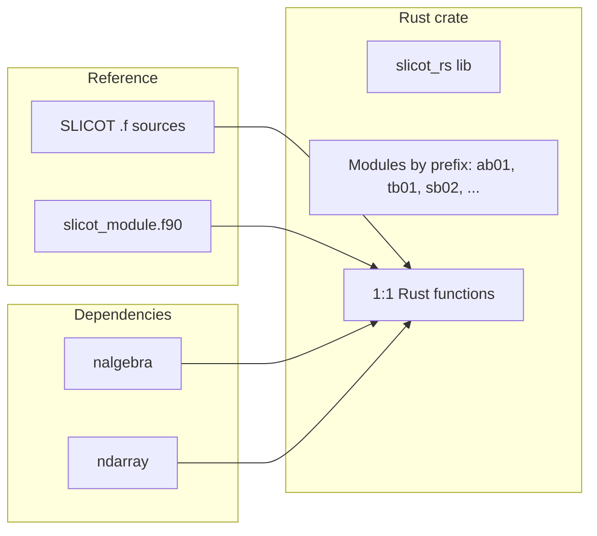

# SLICOT to Pure Rust 1:1 Mapping Plan

## Scope and reference

- **Reference**: [SLICOT-Reference/src/](SLICOT-Reference/src/) — Fortran 77 sources and [slicot_module.f90](SLICOT-Reference/src/slicot_module.f90) (F90 interfaces for ~586 unique routines).
- **Goal**: One Rust function (or module) per SLICOT routine, same behavior and API shape where practical, implemented in **pure Rust** (no FFI to LAPACK/BLAS); use existing Rust linear algebra crates for dense/sparse ops.
- **Naming**: SLICOT names are uppercase (e.g. `TB01MD`). Rust mapping: **all lowercase** (e.g. `tb01md`).

## High-level architecture

- **Crate layout**: One library crate **`slicot-rs`**. Modules grouped by SLICOT prefix (e.g. `ab01`, `tb01`, `sb02`, `mb01`). Each SLICOT routine maps to one public Rust function (name **all lowercase**, e.g. `tb01md`) in the corresponding module.
- **Real and complex**: Support **complex from the start** (generic over scalar or separate real/complex); use nalgebra complex support.
- **Linear algebra**: Prefer **nalgebra** for dense matrices and decompositions; use **ndarray** only if needed. Document which LAPACK/BLAS operations are replaced.
- **API design**: **Inputs** — scalars, option enums/`&str`, matrices/vectors. **Outputs** — in-place updates; **Info-like code** returned (e.g. `i32`) for success/error. **Workspace** — **internal only**.

## Git rules to follow (every commit)

All commits **MUST** follow [.cursor/rules/git](.cursor/rules/git):

| Rule                                                               | Requirement                                                                                                                                                                                                                   |
| ------------------------------------------------------------------ | ----------------------------------------------------------------------------------------------------------------------------------------------------------------------------------------------------------------------------- |
| [commit-format.mdc](.cursor/rules/git/commit-format.mdc)           | First line summary; blank line; list of changes with `-` ; blank line; `-----` (exactly 5 dashes); then technical attribution (Prompt, Context, Justification, Technical details including Model, IDE, Dependencies, Tokens). |
| [commit-atomicity.mdc](.cursor/rules/git/commit-atomicity.mdc)     | **One file per commit** unless an exception applies (e.g. header + impl, test + fix, or tightly coupled files). For this project: one `.rs` file (or one pair under Exception 1b) per commit.                                 |
| [commit-requirement.mdc](.cursor/rules/git/commit-requirement.mdc) | Commit after every created file; after each prompt that changes files; include prompt in technical attribution for token tracking.                                                                                            |
| [upstream-sync.mdc](.cursor/rules/git/upstream-sync.mdc)           | Before committing: `git fetch upstream && git fetch origin`; detect upstream branch; `git merge upstream/<branch>`; resolve conflicts; then commit.                                                                           |
| [user-config.mdc](.cursor/rules/git/user-config.mdc)               | Before first commit in session: set `user.name` to `"$(whoami) | Cursor.sh | Auto"` and `user.email` accordingly.                                                                                                |
| [push-requirement.mdc](.cursor/rules/git/push-requirement.mdc)     | After each commit: run `git push` **if and only if** a remote exists.                                                                                                                                                         |

**Concrete commit workflow per new/edited file:**

1. Run upstream sync (`git fetch upstream && git fetch origin`, then merge as in upstream-sync.mdc).
2. Ensure git user name/email are set (user-config.mdc).
3. Stage only the file(s) for this atomic change (single file or exception set).
4. Commit with message:
   - Line 1: e.g. `Add tb01md (SLICOT TB01MD) in pure Rust`
   - Blank line
   - Bullet list: e.g. `- Add src/tb01/tb01md.rs`, `- Mirror TB01MD controller Hessenberg reduction`
   - Blank line
   - `-----`
   - Technical attribution: Prompt (the user/Cursor prompt that led to this change), Context, Justification, Technical details (Model, IDE, Dependencies, Tokens).
5. If remote exists: `git push`.

No other files may be included in that commit unless an explicit atomicity exception applies.

## Implementation strategy

1. **Bootstrap**
   - Add `Cargo.toml` (name **slicot-rs**), license **BSD-3-Clause** (match SLICOT). No MSRV. Dependencies: `nalgebra` (real + complex), optionally `ndarray`; dev-deps for tests; **criterion** for benchmarks. Configure for **docs.rs** (metadata in Cargo.toml).
   - Add minimal `src/lib.rs` re-exporting modules.
   - Create **mapping index** `docs/SLICOT_MAPPING.md`: every SLICOT routine (including **lapack_aux**) with Rust module/function and status. Update atomically as routines are done.
   - Implement **one pilot routine** (e.g. TB01MD) to lock in: Info-like return code, generic real/complex where applicable, internal workspace, **regression tests against reference** outputs.
2. **Chunks of 50 by subsection**
   - Implement in **chunks of 50 routines** per subsection. Order by SLICOT prefix then name (AB01, TB01, SB02, MB01, ...); **include lapack_aux** in the same ordering. Within a chunk: one file per routine, one commit per file; mapping index updated per chunk (one commit for index or per-file per atomicity rules).
3. **Per-routine workflow**
   - **Parse**: Corresponding `.f` and `slicot_module.f90` for arguments, PURPOSE, METHOD.
   - **Design**: Rust signature (Info-like code), internal workspace, nalgebra/ndarray usage; **complex from the start** where the reference has a Z variant.
   - **Implement**: Pure Rust; no FFI.
   - **Test**: **Regression tests against reference** (e.g. precomputed reference outputs from Octave/MATLAB SLICOT); small unit tests as well.
   - **Commit**: One file per commit with full message and attribution; push if remote exists.
4. **Benchmarks and docs**
   - **Benchmarks**: **Criterion** benchmarks in `benches/` for key routines to **compare** performance (and optionally validate vs reference). Commit benchmark files atomically.
   - **Documentation**: **docs.rs** API docs; doc comments in each module (SLICOT routine name and purpose).

## Deliverables

- **Crate**: **slicot-rs** (BSD-3-Clause), modules by SLICOT prefix, one Rust function per SLICOT routine (all lowercase names); **complex support from the start**; Info-like return codes; internal workspace only.
- **Mapping index**: `docs/SLICOT_MAPPING.md` listing every routine (including **lapack_aux**) and Rust counterpart + status.
- **Tests**: Regression tests against reference outputs for implemented routines.
- **Benchmarks**: Criterion benchmarks in `benches/` to compare performance (and optionally vs reference).
- **Docs**: **docs.rs** API docs; crate configured for docs.rs build.
- **Git history**: Every file committed atomically with required message format and attribution; upstream sync and push per git rules.

## Decisions (from user)

| #   | Topic          | Decision                                     |
| --- | -------------- | -------------------------------------------- |
| 1   | Crate name     | **slicot-rs**                                |
| 2   | Rust names     | **All lowercase** (e.g. `tb01md`)            |
| 3   | Complex        | **From the start** (generic or real+complex) |
| 4   | Error handling | **Info-like code**                           |
| 5   | Workspace      | **Internal only**                            |
| 6   | Tests          | **Regression tests against references**      |
| 7   | LAPACK aux     | **Include in 1:1 mapping**                   |
| 8   | Scope          | **Chunks of 50** by subsection               |
| 9   | MSRV           | **None**                                     |
| 10  | License        | **Match SLICOT (BSD-3-Clause)**              |
| 11  | Benchmarks     | **Add benchmarks to compare**                |
| 12  | Docs           | **Generate docs.rs**                         |

## Plan TODOs (execution order)

- **Save this plan** to `plans/slicot-to-pure-rust-mapping.md` and commit it per git rules (first TODO per [plans-first-todo.mdc](.cursor/rules/cursor/plans-first-todo.mdc)).
- Add `Cargo.toml` (slicot-rs, BSD-3-Clause, no MSRV, nalgebra, criterion; docs.rs metadata) and minimal `src/lib.rs`; commit each file atomically.
- Create mapping index `docs/SLICOT_MAPPING.md` listing all SLICOT routines (including lapack_aux) and Rust targets; commit atomically.
- Implement pilot routine (e.g. TB01MD) with Info-like code, internal workspace, regression tests; commit atomically.
- Add criterion benchmark harness in `benches/`; commit atomically.
- Implement routines in **chunks of 50** by subsection (prefix order, lapack_aux included), one file per routine, one commit per file; regression tests and mapping index updates per chunk.
